# How to Solder Head Pins on the Waveshare ESP32-S3-Touch-LCD-1.47

## Introduction
I created this guide because I couldn’t find any clear or beginner-friendly instructions online for soldering head pins on the Waveshare ESP32-S3-Touch-LCD-1.47. After some trial and error, this method worked reliably for me, so I decided to document the process to help others.

This guide was written based on my own experience, with the help of AI to improve clarity, structure, and beginner-friendliness.

---

## Tools and Materials
- Soldering iron (fine tip recommended)
- Solder (leaded solder is easier for beginners)
- Flux
- Helping hands or PCB holder
- Male pin headers (head pins)
- Black pencil
- Safety glasses (recommended)

---

## Soldering Iron Temperature
- Recommended temperature: **350–400 °C**
- Start closer to **350 °C** and increase only if the solder does not flow well.
- Avoid staying on a pad for more than **2–3 seconds** to prevent damage.

---

## Safety Tips
- Work in a **well-ventilated area** to avoid inhaling fumes.
- Never touch the soldering iron tip—it gets extremely hot.
- Use **flux sparingly** to improve solder flow.
- Avoid overheating pads; let the board cool if it becomes hot.
- Always check alignment before soldering all pins.
- Wear safety glasses to protect your eyes from solder splashes.

---

## Step-by-Step Guide

### 1. Mark the Pins
Take the head pins and use a black pencil to mark the pins close to the black plastic spacer.

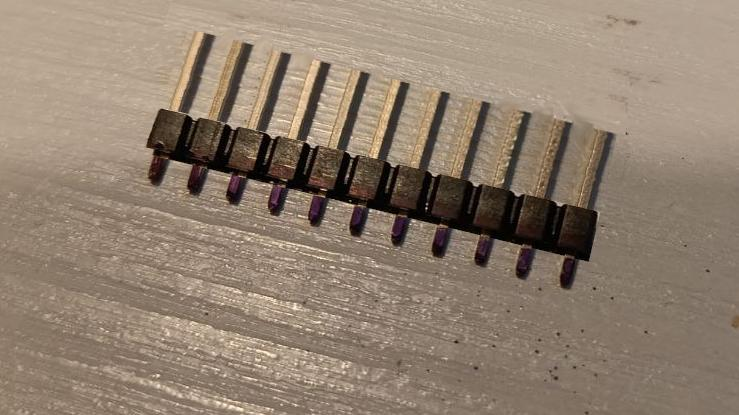

---

### 2. Move the Plastic Spacer
Slide the plastic spacer along the pins until it reaches the opposite ends of the pins.

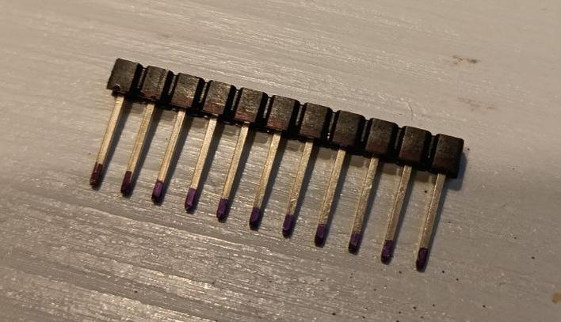

---

### 3. Secure the Head Pins
Hold the head pins by the plastic spacer using helping hands or a similar tool.

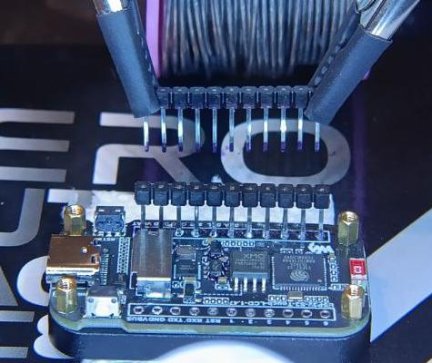

---

### 4. Align the Head Pins
Apply a small amount of flux to the ESP32 pads. Align the head pins with the pads and lower them until the pencil marks disappear.  
Make sure the head pins are **perfectly perpendicular** to the PCB.

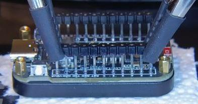

---

### 5. Tack Two Pins
Solder **only two pins first** (one near each end) to temporarily fix the position.

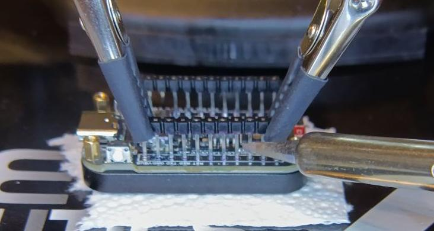

---

### 6. Solder One Side
Check alignment from the side. If everything is straight, remove the helping hands and solder the remaining pins on that side.

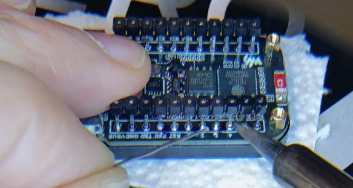

---

### 7. Repeat on the Other Side
Repeat the same process for the other row of pads and head pins.

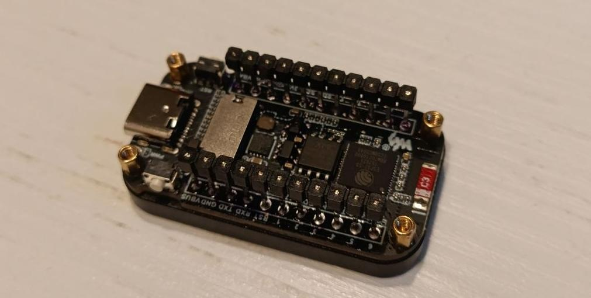

---

### 8. Reposition the Plastic Spacers
Using your fingernails (or a small flat tool), **slowly and carefully slide the plastic spacers back to their original positions**.  
Do this gently and evenly on both sides.

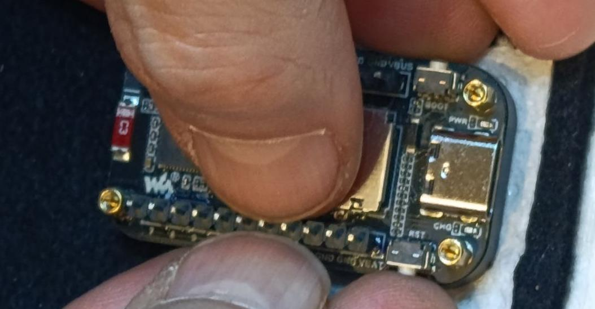

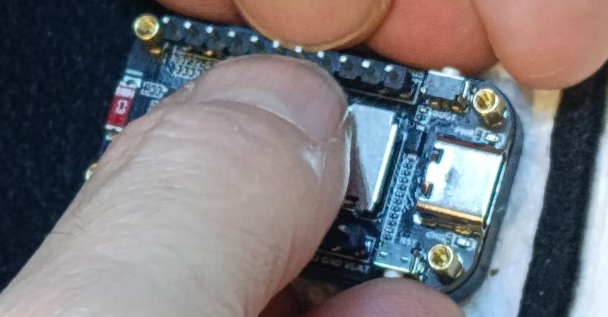

---

### 9. Final Result
Inspect all solder joints:
- Joints should be shiny
- No solder bridges between pins
- Pins should be straight and firmly attached

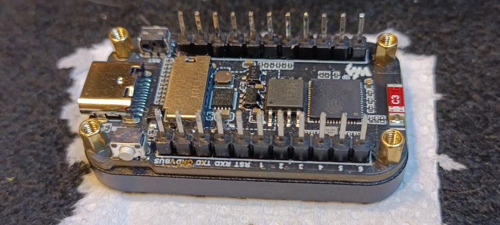

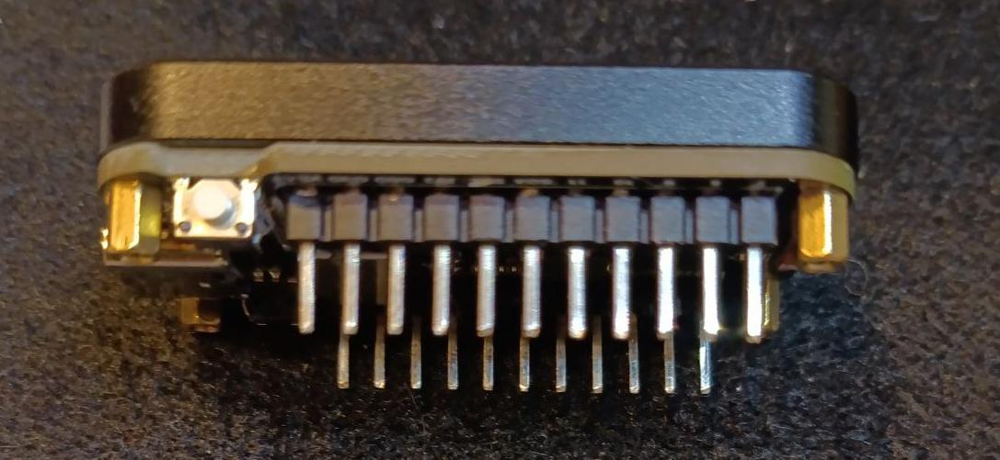

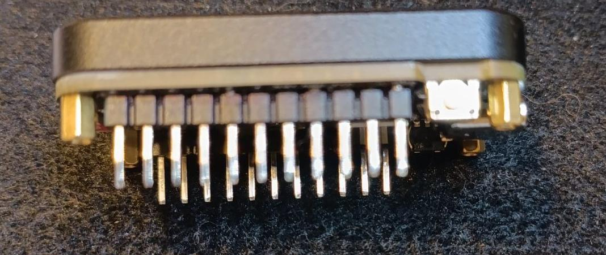

---

## Beginner Tips
- Practice on a spare PCB before working on the ESP32.
- If a joint looks dull or uneven, reapply flux and reheat briefly.
- Take your time—good alignment is more important than speed.

---

## Notes
This guide reflects my personal workflow and may not be the only valid method.  
Example images are included to visually support each step.
